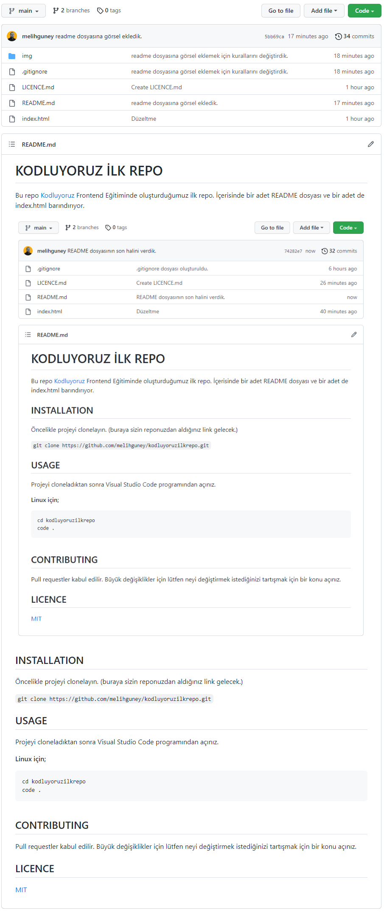

# KODLUYORUZ İLK REPO

Bu repo [Kodluyoruz](https://www.kodluyoruz.org) Frontend Eğitiminde oluşturduğumuz ilk repo. İçerisinde bir adet README dosyası ve bir adet de index.html barındırıyor.



## INSTALLATION

Öncelikle projeyi clonelayın. (Buraya sizin reponuzdan aldığınız link gelecek.)

`git clone https://github.com/melihguney/kodluyoruzilkrepo.git`

## USAGE

Projeyi cloneladıktan sonra Visual Studio Code programından açınız.

**Linux için;**

```
cd kodluyoruzilkrepo
code .
``` 

## CONTRIBUTING

Pull requestler kabul edilir. Büyük değişiklikler için lütfen neyi değiştirmek istediğinizi tartışmak için bir konu açınız.

## LICENCE

[MIT](https://choosealicense.com/licenses/mit/)